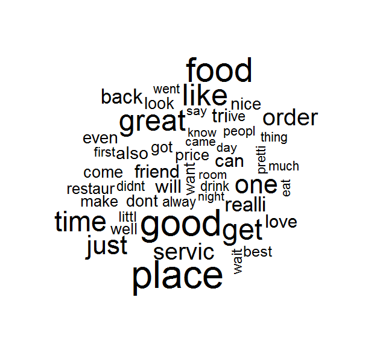

### I Introduction

The tips on the Yelp web site is the insider information provided by the Yelp's users or reviewers. The text of the tips contain the sentiments of the users of how they would recomend for the other users when they use the service or buy a product from a particular business. They can positive or negative and should be consistent with review posted by the same user. In this study, I will try to predict a business overall rating based on only the text of tips to see how the tips can affect the rating or image of the business.

### II Methods and Data

To create and train a prediction model for business ratings, I use two datasets, "yelp_academic_dataset_business.json" and "yelp_academic_dataset_tips.json" from [Yelp Dataset Challenge](http://www.yelp.com/dataset_challenge) (Rounds 5 and 6).

Both files are in JSON format. The files will be read, merged and cleaned up before they are used for developing the prediction model.  


The algorithm I use to develop the prediction model is called the LASSO (Least Absolute Shrinkage and Selection Operator) which was developed by Robert Tibshirani in 1996. The LASSO is derived from multiple linear regression and is similar to Ridge Regression which penalize the coefficients to minimize overfitting. The LASSO has an advantage over Ridge Regression though is that it not only shrinks the coefficients but also force some of the coefficients to be exactly zero when the tuning parameter $\lambda$ is selected large enough.  

$rating = \beta_{0} + \beta_{1}T_{1} + \beta_{1}T_{2} + ... + \beta_{p}T_{p} + \varepsilon$  

Where the $T_{p}$ is the popular word or term appears in the tips and $\varepsilon$ is a mean-zero random error term.  
The goal of the LASSO is to find the coefficients those can minimize the quantity below:  

$\sum_{i=1}^{n}({rating}_{i} - \beta_{0} - \sum_{j=1}^{p}\beta_{j}{T}_{ij})^2 + \lambda\sum_{j=1}^{p}{|}\beta_{j}{|} = RSS + \lambda\sum_{j=1}^{p}{|}\beta_{j}{|}$  

To get the most popular words from the tips as the features of the LASSO model, text mining technique is used. There are more than 80,000 words found in the text of the tips but many of them are not frequent used terms (high sparsity). So we filter out those terms with more than 99% sparsity and keep around 290 terms for the model development.

The study first estimates the predicted rating and mean square errors (MSE) from a naive model for comparison. Then we train and validate a LASSO model using _unigrams_ (single word in each term) and _bigrams_ (two adjacient words in each term).
    
```{r Loading library, eval=TRUE, results='hide'}
## load required libraries
library(jsonlite)
library(NLP)
library(tm)
library(SnowballC)
library(wordcloud)
library(glmnet)
library(ggplot2)
```
#### Reading data
```{r,  eval=TRUE, results='hide'}
bus <- stream_in(file("yelp_academic_dataset_business.json"))
tips <- stream_in(file("yelp_academic_dataset_tip.json"))

```

```{r, eval=TRUE}
## user defined functions
PlotWordCloud <- function (docTermMatrix, maxwords) {
  ## Find frequent terms
  freq <- colSums(docTermMatrix)
  freq <- sort(freq, decreasing=TRUE)
  ## make word cloud
  word <- names(freq)
  wordcloud(word, freq, max.words=maxwords, colors=brewer.pal(6,"Dark2"))
  
  wf <- data.frame(word=word, freq=freq)
  return(wf)
}

GetModelingData <- function (docTermMatrix) {
  ## add the business ID column to the term matrix
  dtm_tips <- cbind(business_id=tips$business_id, as.data.frame(docTermMatrix))
  
  ## merge the business ratings with tip terms dataframe
  bustips <- merge(bus[,c("business_id","stars")], dtm_tips, by="business_id")
  ## business ID column is no longer needed
  bustips$business_id <- NULL

  ## prepare the training and test data
  x <- model.matrix(stars~., bustips)[,-1]
  y <- bustips$stars
  ## create a list of lambdas for regularization
  lambdas <- 10^seq(10,-2, length=100)
  set.seed(1)
  ## randomly get 70% of the data for training, 30% for validation
  train<-sample (1: nrow(x), nrow(x) * 0.7)

  return(list(x=x, y=y, train=train, lambdas=lambdas))
}

LassoRegression <- function (params) {
  train <- params$train
  test <- (-train)
  lasso.mod <- glmnet(params$x[train,], params$y[train], alpha=1, lambda=params$lambdas)
  set.seed(2)
  cv.out <- cv.glmnet(params$x[train,], params$y[train], alpha=1)
  bestlamda <- cv.out$lambda.min
  lasso.pred  <- predict(lasso.mod, s=bestlamda, newx=params$x[test,])
  mse <- mean((lasso.pred - params$y[test])^2)
  out <- glmnet (params$x, params$y, alpha=1, lambda=params$lambdas)
  lasso.pred.coef <- predict(out, type="coefficients", s=bestlamda)
  ## get the coefficients vector
  lasso.coef <- lasso.pred.coef[1:dim(lasso.pred.coef)[1],]
  
  return(list(mod=lasso.mod, bestlamda=bestlamda, mse=mse, coef=lasso.coef))
}

```

#### Text mining on the tip texts
```{r, eval=TRUE}

## set the tip texts as the source
vsource <- VectorSource(tips$text)
tiptexts <- Corpus(vsource)

## cleaning
tiptexts <- tm_map(tiptexts, content_transformer(tolower))
tiptexts <- tm_map(tiptexts, removeNumbers)
tiptexts <- tm_map(tiptexts, removePunctuation)
tiptexts <- tm_map(tiptexts, stripWhitespace)

```

#### Naive model
```{r, eval=TRUE}
## The predicted rating is simply the average of the ratings in the training data
naive.pred <- mean(bus$stars)
## Mean square errors (MSE) of the naive model
naive.mse <- mean((naive.pred - bus$stars)^2)
```
Business average overall rating: __`r naive.pred`__  


#### The Lasso Regression using Unigrams
```{r,  eval=TRUE}
## prepare data
tiptexts_ugm <- tm_map(tiptexts, removeWords, stopwords("english"))
tiptexts_ugm <- tm_map(tiptexts_ugm, stemDocument)
## create a document-term matrix from the tip texts
dtm <- DocumentTermMatrix(tiptexts_ugm)
## remove the terms with more than 99.6% sparcity from the dtm
dtm <- removeSparseTerms(dtm, 0.996)
## save the dtm as a regular matrix for later processing
dtm2 <- as.matrix(dtm)
## train model
data <- GetModelingData(dtm2)
out_ugm <- LassoRegression(data)

## plot word cloud and bar chart for most frequent used terms
wf_ugm <- PlotWordCloud(dtm2, 100)
ggplot(data = subset(wf_ugm, freq>10000), aes(word, freq)) + 
  geom_bar(stat="identity") + theme(axis.text.x=element_text(angle=45, hjust=1))

rm(tiptexts_ugm, dtm, dtm2, data)
```

#### The Lasso Regression using Bigrams
```{r,  eval=TRUE}
## bigrams data (stop words are kept in the matrix)
tiptexts_bgm <- tm_map(tiptexts, stemDocument)
BigramTokenizer <- function(x) {unlist(lapply(ngrams(words(x), 2), paste, collapse = " "), use.names = FALSE)}
dtm <- DocumentTermMatrix(tiptexts_bgm, control = list(tokenize = BigramTokenizer))
dtm <- removeSparseTerms(dtm, 0.998)
dtm2 <- as.matrix(dtm)
data <- GetModelingData(dtm2)
out_bgm <- LassoRegression(data)
wf_bgm <- PlotWordCloud(dtm2, 50)
ggplot(data = subset(wf_bgm, freq>5000), aes(word, freq)) + 
  geom_bar(stat="identity") + theme(axis.text.x=element_text(angle=45, hjust=1))
rm(tiptexts_bgm, dtm, dtm2, data)

```

### III Results  
Here are the results from the three different models:  

Model            | MSE             | RMSE                 | Total No. of Features     | No. of Features with non-zero coefficient
---------------- | --------------- | -------------------- | ------------------------- | -----------------------------------------
Naive            | `r naive.mse`   | `r sqrt(naive.mse)`  | N/A                       | N/A
Lasso (unigrams) | `r out_ugm$mse` | `r sqrt(out_ugm$mse)`| `r length(out_ugm$coef)-1`| `r length(out_ugm$coef[out_ugm$coef != 0])`
Lasso (bigrams)  | `r out_bgm$mse` | `r sqrt(out_bgm$mse)`| `r length(out_bgm$coef)-1`| `r length(out_bgm$coef[out_bgm$coef != 0])`

Features in unigram model with non-zero coefficient:  
(_`r names(out_ugm$coef[out_ugm$coef!=0])[-1]`_)  
Features in bigram model with non-zero coefficient:  
(_`r names(out_bgm$coef[out_bgm$coef!=0])[-1]`_)  


### IV Discussion  
As you can see from the results, the LASSO regression model (unigrams or bigrams) has a lower mean square error (MSE) rate. So the LASSO model is a better model than the baseline naive model. Also, for the Lasso unigrams model, the original number of features used for the model training is `r length(out_ugm$coef[out_ugm$coef != 0])`. Now the actual number of features is `r length(out_ugm$coef)-1`. So the Lasso algorithm not only minimize the overfitting but also reduce the dimensions of the final model.   
  
Ridge regression can produce a better error rate which is about 0.3481998 in MSE, but it doesn't force some coefficients to be exactly zero. Principal Component Analysis (PCA) can reduce the dimensions but it is harder to interpret because the new features (principal components) are no longer the original features.

I train the model using bigrams because I think using two adjacent words in a term should have a better sentiment, but it doesn't seem to have a better prediction rate than using the unigrams.

One interesting finding from the model is that the top 42 most frequent terms in the tips are not necessarily the features in the Lasso final model:  

42 most frequent terms:  
(_`r sort(wf_ugm$word[1:42])`_)  

There are only 13 out of 42 most frequent terms are in the features of the final Lasso model. So in other words, most frequent terms do not necessary contribute to the rating prediction.

In the Yelp dataset, the Reviews contain similar sentiment data to the Tips, and each reviews associates with a direct votes for the business rating. So it may be a better tool to develop a predicting model; and actually there are some people have done some work in this direction. The following word cloud show the top 50 most frequent terms in the review text.  




This study does not try to override the work done by other people using the Reviews data, but just try to understand the correlation between the ratings and tips.  

In conclusion, the predicting model based on the Tips using the Lasso regression works pretty well, the error rate `r out_ugm$mse` is comparable to the ones of the models based on Reviews.